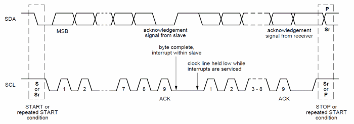

# **Linux I2C Interface**
## **1. I2C란?**
### **1.1 소개**
#### I2C(I-Square-C 아이스퀘어씨)는 필립스가 제안한 통신 방식이며 주변장치들을 두가지 선, 클럭인 SCL과 데이터인 SDA만 사용하여 동작하는 방식이다. I2C 버스에는 표준모드(100Kbps), 저속모드(10Kbps), 고속모드(400Kbps) 그리고 초고속모드(3.4Mbps)가 있다. I2C 버스는 각 장치에 7bit, 10bit 주소를 지정하여 여러 장치들을 독립적으로 접근한다.
### **1.2 디바이스 주소**
#### 슬레이브가 되는 디바이스를 지정하기 위해 보통 7bit 혹은 10bit의 형식으로 주소가 표기된다. 보통 7bit의 주소를 사용하는 경우가 많으며 이런 경우 마스터가 최대로 지정할 수 있는 기기 대수는 128대로 제한된다. 주소는 디바이스를 제작한 제작사가 지정하거나 외부핀을 이용하여 지정하거나 주소 상위비트는 고정하고 하위비트만 지정하는 경우가 일반적이다.
### **1.3 SCL, SDA 신호선**
#### I2C를 사용하기 위해서 MCU는 디바이스에 정보를 전달하기위해 이 두 신호선을 사용한다. SCL은 동기용 클럭핀이며 마스터가 클럭 신호를 공급하기 때문에 단방향성을 가진다 SDA는 마스터와 슬레이브 둘다 데이터를 전달하며 양방향성을 가진다. 이 두선은 풀업 저항으로 연결되어 있으며 최대 전압은 +5V, 일반적으로 +3.3V를 사용하며 다른 전압도 사용가능하다.
### **1.4 I2C 버스 데이터 전송**

#### __START__ 
#### START는 마스터가 슬레이브에게 전송 시작을 알리기 위한 것으로 I2C 버스를 사용한다는 신호의 시작이다. 이 신호는 1비트로 구성되며 SCL이 HIGH 상태이며, SDA가 HIGH에서 LOW로 변화되면 START 신호로 해석된다.
#### __주소 프레임(Address Frame)__
#### 주소 프레임은 항상 모든 통신 데이터 앞에 위치한다. 데이터 라인으로 처음 수신되는 1바이트 중 7비트 데이터(MSB)가 I2C 주소를 나타낸다. 마지막 1비트는 읽기(raed, 0) 또는 쓰기(write, 1) 동작임을 표현한다.
#### __ACK__
#### 슬레이브는 마스터로부터 데이터를 수신할 경우나 슬레이브에서 마스터에 데이터를 전달할 경우 ACK신호를 표현하며 이 때가 잠시 슬레이브가 SDA를 제어할 수 있는 시간이다.
#### __데이터 프레임(Data Frame)__
#### 주소 프레임이 전송이 완료되면 데이터 프레임을 전송하기 시작한다. 이때 read,write 상태에 따라 마스터나 슬레이브가 SDA 라인을 사용한다.
#### __STOP__
#### STOP은 마스터가 슬레이브에게 전송 종료를 알리며 I2C 버스를 종료하는 신호다. 이 신호또한 1비트로 표현되며 SCL이 HIGH 상태이며 SDA가 LOW HIGH로 변화되면 STOP 비트로 해석된다.

***

## **2. 리눅스에서 I2C 인터페이스 사용하기**
### **2.1 i2c-tools**
#### I2C 디바이스가 연결되어있는지 또는 디바이스 내의 레지스터를 읽어오거나 쓰고 싶은 경우 명령어를 통해 간단하게 확인이 가능하다.
#### i2cdetect
#### i2cdetect 명령어는 현재 버스에서 이용가능한 i2c 디바이스들을 나타내거나 검색할 때 사용한다. -l 옵션을 사용하면 현재 버스에 접속된 기기들의 리스트가 나오며 숫자을 옵션으로 넣을경우 N번의 버스에서 응답받는 리스트를 보여준다.
#### i2cget
#### i2cget 명령어를 이용하면 디바이스 내의 레지스터 비트셋을 16진수로 읽어올 수 있다.
```
#i2cget 0 0x44 0xD0
0x60
```
#### 위의 예시는 BME280의 ID 레지스터를 읽어오는 예시다. 값을 읽어올 경우 형식은 i2cget [버스] [슬레이브 주소] [레지스터 주소]가 된다.
#### i2cset
#### i2cset 명령어는 i2cget 명령어와는 반대로 디바이스 내의 레지스터 비트셋을 쓰는 명령어이다. 명령어 형식은 i2cset [버스] [슬레이브 주소] [레지스터 주소] [데이터] 형식이 된다.

### **2.2 예제 코드**
#### I2C 디바이스에 접근하는 프로그램을 작성할 경우 i2c-dev.h 파일이 필요하다. 리눅스에서 i2c를 사용하는 방법은 드라이버 덕분에 간단하게 파일입출력 함수로 제어할 수 있다. i2c-dev에서는 I2C 프로토콜이 미리 정의가 되어있어 read, write 함수를 사용하면 자동으로 START와 STOP이 발생된다.<br>i2c를 사용하기 위해서는 버스를 개설하고 통신 초기화를 해야하며 아래와 같이 진행된다.
```c
//버스 개설
int file;
char *filename = "/dev/i2c-0";          //0번 버스
if ((file = open(filename, O_RDWR)) < 0) {
    perror("Failed to open the i2c bus");
    exit(1);
}

//통신 초기화
int addr = 0x44;          
if (ioctl(file, I2C_SLAVE, addr) < 0) { //SHT3x-DIS의 슬레이브 주소
    printf("Failed to acquire bus access and/or talk to slave.\n");
    exit(1);
}
```
#### 읽기와 쓰기의 경우 각 디바이스의 데이터시트에 따라 보내는 순서를 결정하면 된다. SHT3x-DIS의 경우 |Slave Address|MSB Command|LSB Command|Data| 형식으로 진행되는데 read, write를 사용할경우 스타트비트와 슬레이브 주소를 보낼 필요없이 레지스터 명령어 혹은 레지스터나 데이터만 보내면 된다.
```c
//레지스터 주소와 데이터를 보낸다.
int WriteData(uint8_t reg_addr, uint8_t *data, int size) {
    uint8_t *buf;
    buf = malloc(size + 1);
    buf[0] = reg_addr;
    memcpy(buf + 1, data, size);
    write(fd, buf, size + 1);
    free(buf);

    return 1;
}
//레지스터 주소를 보낸 후 데이터를 읽는다.
int ReadData(uint8_t reg_addr, uint8_t *data, int size) {
    write(fd, &reg_addr, 1);
    read(fd, data, size);

    return 1;
}
```
#### 일반적인 경우 위의 포맷대로 진행되며 SHT3x-DIS의 경우 16비트 명령어를 나누어 reg_addr과 data로 나누어 보내 쓰기를 진행하였고 읽을 때에는 슬레이브 주소만 보내면 되기에 read()만 사용하여 읽었다.
```c
#include <stdio.h>
#include <stdlib.h>
#include <linux/i2c-dev.h>
#include <fcntl.h>
#include <unistd.h>
#include <stdint.h>
#include <sys/ioctl.h>
#include <string.h>
#include <unistd.h>

#define SHT_ADDRESS                     0x44
#define SHT_MEAS_HGIHREP_STRETCH        0x2C06
#define SHT_MEAS_MEDREP_STRETCH         0x2C0D
#define SHT_MEAS_LOWREP_STRETCH         0x2C10
#define SHT_MEAS_HIGHREP                0x2400
#define SHT_MEAS_MEDREP                 0x240B
#define SHT_MEAS_LOWREP                 0x2416
#define SHT_READSTATUS                  0xF32D
#define SHT_CLEARSTATUS                 0x3041
#define SHT_SOFTRESET                   0x30A2
#define SHT_HEATEREN                    0x306D
#define SHT_HEATERDIS                   0x3066

int fd;

int WriteData(uint8_t reg_addr, uint8_t *data, int size) {
    uint8_t *buf;
    buf = malloc(size + 1);
    buf[0] = reg_addr;
    memcpy(buf + 1, data, size);
    write(fd, buf, size + 1);
    free(buf);

    return 1;
}

void ReadTempHum() {
    uint8_t reg, cmd;
    uint8_t buf[6];
    double temp, hum;

    while(1) {
        reg = SHT_MEAS_HIGHREP >> 8 & 0xFF;
        WriteData(reg, &cmd, 1);
        //sleep(1);
        sleep(1);
        read(fd, buf, 6);
        uint16_t ST, SRH;
        //raw 데이터 받기 형식은 8비트씩 |Temp MSB|TEMPLSB|CRC|HUM MSB|HUM LSB|CRC|
        ST = buf[0];        //앞쪽 8비트 온도
        ST <<= 8;
        ST |= buf[1];

        SRH = buf[3];
        SRH <<= 8;
        SRH |= buf[4];


        //온도 및 습도 구하기
        double stemp = ST;
        stemp *= 175;
        stemp /= 0xffff;
        stemp = -45 + stemp;
        temp = stemp;

        double shum = SRH;
        shum *= 100;
        shum /= 0xFFFF;
        hum = shum;
        printf("Temperature: %.3lf, Humidity: %.3lf\r\n", temp, hum);
    }
    
}

uint16_t ReadStatus() {
    uint8_t reg, cmd;
    uint8_t data[3];
    uint16_t status;
    reg = SHT_READSTATUS >> 8 & 0xFF;
    cmd = SHT_READSTATUS & 0xFF;
    WriteData(reg, &cmd, 1);
    read(fd, data, 3);
    status = data[0] << 8;
    status |= data[1];

    return status;
}

void Heater(int h) {
    uint8_t reg, cmd;
    if (h){
        reg = SHT_HEATEREN >> 8 & 0xFF;
        cmd = SHT_HEATEREN & 0xFF;
    } else {
        reg = SHT_HEATERDIS >> 8 & 0xFF;
        cmd = SHT_HEATERDIS & 0xFF;
    }
    WriteData(reg, &cmd, 1);
}

void Reset() {
    uint8_t reg, cmd;
    reg = SHT_SOFTRESET >> 8 & 0xFF;
    cmd = SHT_SOFTRESET & 0xFF;
    WriteData(reg, &cmd, 1);
}

int main(int argc, char *argv[])
{
    if((fd = open(argv[1], O_RDWR)) < 0) {
        perror("Failed to open i2c-0");
        exit(1);
    }
    if(ioctl(fd, I2C_SLAVE, 0x44) < 0) {
        perror("Failed to acquire bus access and/or talk to slave\n");
        exit(1);
    }
    printf("Good\n");
    ReadTempHum();

    return 0;
}
```
#### 위 코드는 앞서 설명한 것들을 포함하고 SHT3x-DIS를 제어하기위한 함수 및 옵션을 넣어 만든 코드이다. 이제 컴파일을 할 때 i3 보드를 기준으로 arm-linux-gnueabihf-gcc 명령어를 사용하면 끝이다!